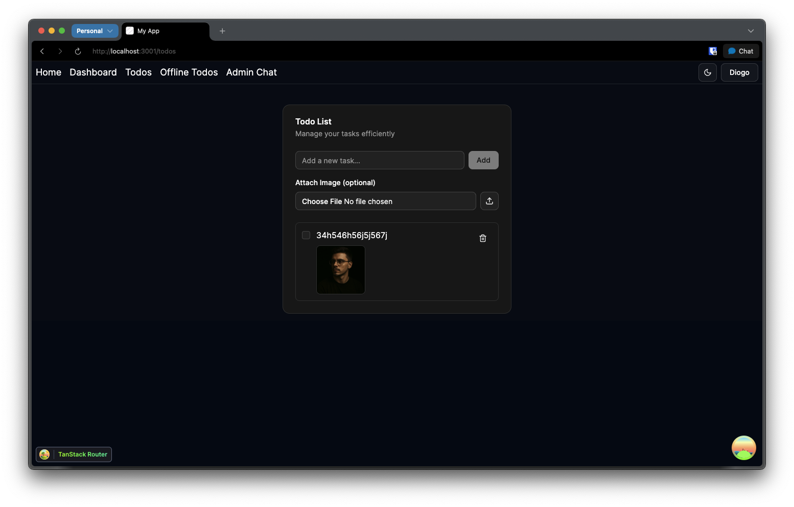

# Future Stack

This project was created with [Better-T-Stack](https://github.com/AmanVarshney01/create-better-t-stack), a modern TypeScript stack that combines React, TanStack Router, Hono, ORPC, and more.

## Features

- **TypeScript** - For type safety and improved developer experience
- **TanStack Router** - File-based routing with full type safety
- **TailwindCSS** - Utility-first CSS for rapid UI development
- **shadcn/ui** - Reusable UI components
- **Hono** - Lightweight, performant server framework
- **oRPC** - End-to-end type-safe APIs with OpenAPI integration
- **workers** - Runtime environment
- **Drizzle** - TypeScript-first ORM
- **PostgreSQL** - Database engine
- **Authentication** - Email & password authentication with Better Auth
- **PWA** - Progressive Web App support with installation prompts
- **Turborepo** - Optimized monorepo build system

## Screenshots

### Home Page


### Dashboard


### Todos


### Offline Todos


### Admin Chat


## Getting Started

First, install the dependencies:

```bash
bun install
```
## Database Setup

This project uses PostgreSQL with Drizzle ORM.

1. Make sure you have a PostgreSQL database set up.
2. Update your `apps/server/.env` file with your PostgreSQL connection details.

3. Apply the schema to your database:
```bash
bun db:push
```


Then, run the development server:

```bash
bun dev
```

Open [http://localhost:3001](http://localhost:3001) in your browser to see the web application.
The API is running at [http://localhost:3000](http://localhost:3000).


## Project Structure

```
future-stack/
├── apps/
│   ├── web/         # Frontend application (React + TanStack Router)
│   └── server/      # Backend API (Hono, ORPC)
```

## Available Scripts

- `bun dev`: Start all applications in development mode
- `bun build`: Build all applications
- `bun dev:web`: Start only the web application
- `bun dev:server`: Start only the server
- `bun check-types`: Check TypeScript types across all apps
- `bun db:push`: Push schema changes to database
- `bun db:studio`: Open database studio UI
- `cd apps/web && bun generate-pwa-assets`: Generate PWA assets

## PWA Installation

The app includes a dedicated PWA installation page at `/install-pwa` that provides:

- **Automatic Installation Detection** - Detects if the app is already installed
- **Cross-Platform Support** - Works on iOS, Android, and Desktop browsers
- **Installation Prompts** - Smart prompts that appear when the app can be installed
- **Manual Instructions** - Step-by-step installation guides for different platforms
- **Feature Showcase** - Highlights offline support, image handling, and native app features

The PWA installation prompts also appear on the home page and offline todos page to encourage users to install the app for the best experience.
